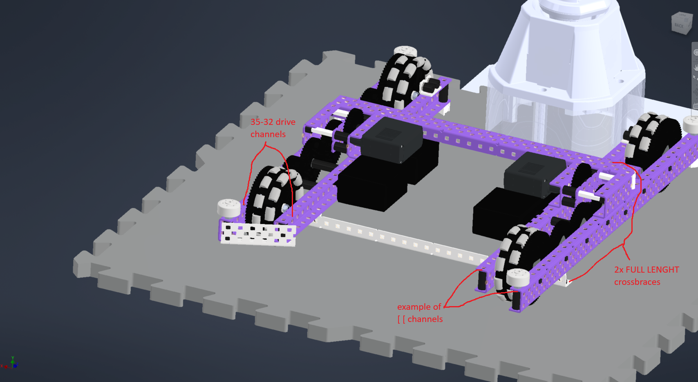
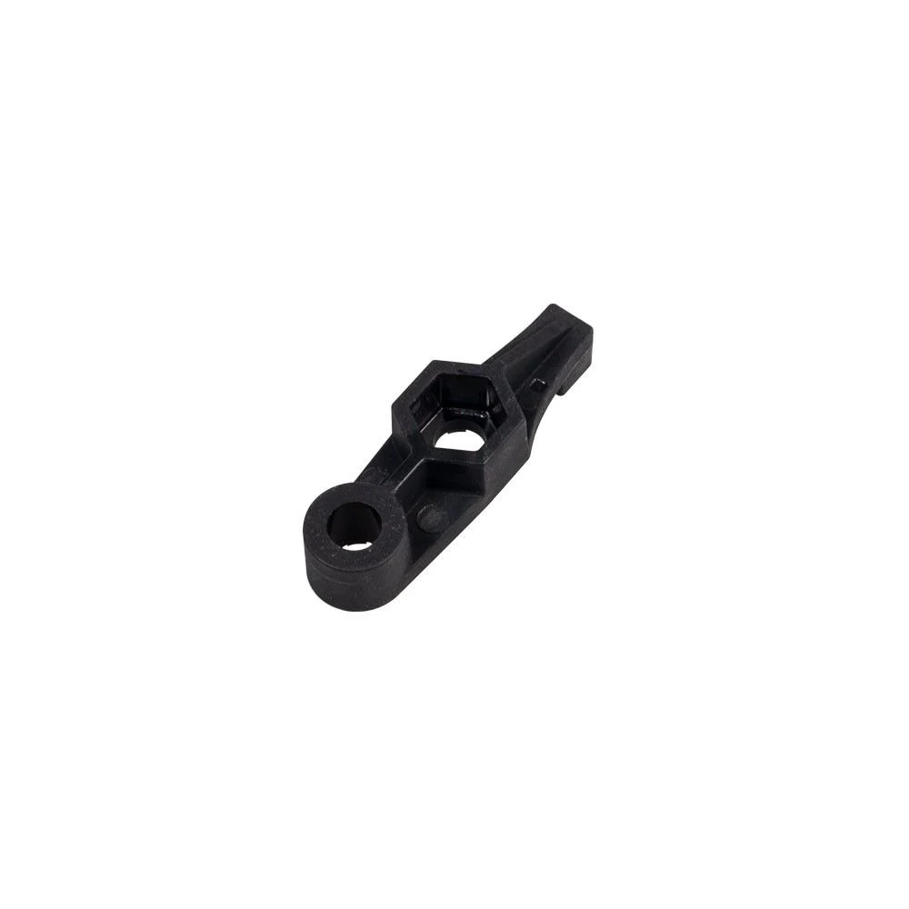
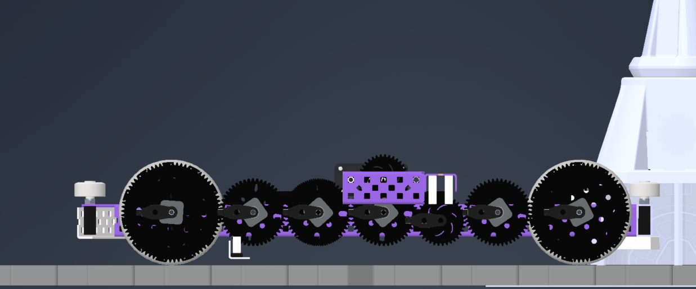
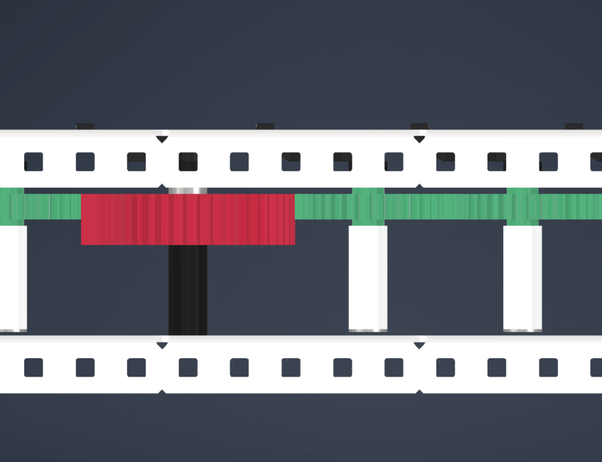
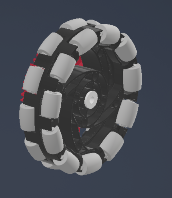

# Building a Drivetrain

Building your drive is the next step in the process; hopefully you picked a drive speed, gearing, and everything else from the [Drivetrain Design](../design/drivetrain-design.md) entry. Now we will cover building your drive.

## Chassis
I'll call the chassis the drive layout without any wheels and gearing on it. In this part, you will get your C-channels for the drive, mount the cross braces, and put on your bearings. You will need at least 6 pieces of metal, the drive channels, and the cross braces to build the frame.

### Drive Channels

* **Drive channels**: the parallel metal on your drive chassis everything is mounted on. There are different layouts; they include: *(note:* `[ [`, `] [`, `[ ]` *is the common way to represent C-channel direction on a drive)*
    * `[ [`: this is my favorite; it mounts the motors inwards and looks the nicest
    * `] [`: this mounts motors inwards and is easy to work on at the cost of around .062" of less space compared to `[ [`; 2nd favorite, but I don't run it
    * `[ ]`: I've seen newer teams run this; I don't like this. It mounts the motors super far out and is still hard to work on. Do not recommend.

### Bearings
**Mounting bearings:** Lay out your gear chain and determine the location of the [bearings](https://www.vexrobotics.com/v5-bearings.html); these pieces of plastic reduce friction and decrease gear slop and are NEEDED on the drive. Of the different bearing types, I recommend [v3](https://www.vexrobotics.com/standoff-retainers.html) [ones](https://www.vexrobotics.com/nut-retainers.html) because they only need 1 screw. Also use nylon/aluminum screws to save weight.

/// caption
A V3 bearing.
///

/// caption
Drive base bearings (V3 bearings).
///

### Cross Braces
* **Cross braces**: perpendicular metal covering side to side of the drive; I recommend at least 2 of them.

**Mounting your cross braces:** You can mount your cross braces with either standoffs and 2 screws or lock nuts and spacers with a nut and screw. Standoffs are by far easier to take off but you have to [Loctite](building-habits.md) one side for the screws to not come loose. Lock nuts and spacers are more secure but are a PAIN to take off requiring a lot more skill and effort. (personally I use standoffs).

### Other
**Squaring your drive:** Your drive needs to be perfectly parallel and perpendicular. In order to achieve this, copy this video:

  

    <iframe src="https://www.youtube.com/embed/yC_6j7vawfk" frameborder="0" allowfullscreen
      style="position:absolute;top:0;left:0;width:100%;height:100%;"></iframe>
  

I also recommend using [shoulder screws](https://www.whimsytech.net/products/t15-flat-head-screws-0-09-shoulder-locking) for a more precise fit.

**[Boxing your drive](building-habits.md):** Use .875" spacers on the corners of your drive.

## Drive Chain and Wheels
The next step is adding your gears wheels and motors. First, let's add the drive gears and idlers.

### Drive Gears
**Drive gears**: these are powered gears and will be mounted on a shaft. I will leave spacing up to you to decide but I'll go ahead and warn you: you need the gears to have around 0.062” of clearance from the drive channels.

/// caption
Drive gears (green) and an idler gear (red). Notice the gap from the side of the drive.
///

### Wheels
Mount the wheels last. The wheels will be on [screw joints](building-habits.md) using 2.5" screws. The gears/wheels need circle inserts. I space the gears .031" off the wheel. Make sure to use 2 screws and nylon lock nuts to secure the wheels to the gear. I mount the wheels/gear assembly at least .62" off the channel.

**Screws:** I recommend flat head screws on your wheels to increase clearance. You can either purchase them or use a sander to make them.

### Motors
This is fairly simple; all you need to do is screw the motors where your drive gears are. Do NOT use bearings on motors; this mounts them further out and increases friction. Motors are bearings themselves, so do not do this.

*By Harrison Elkins*
