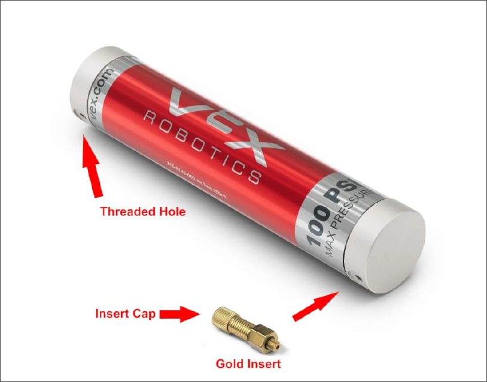
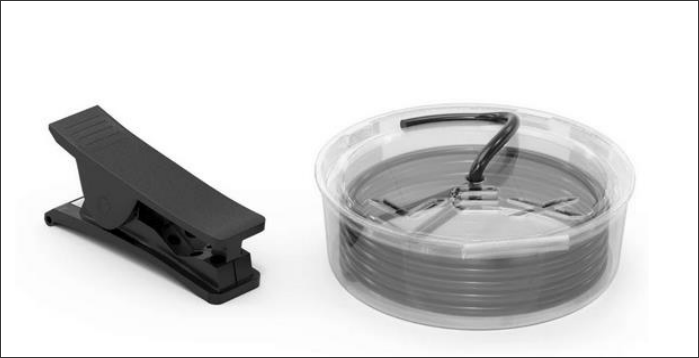
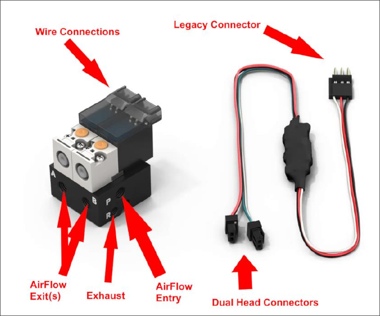
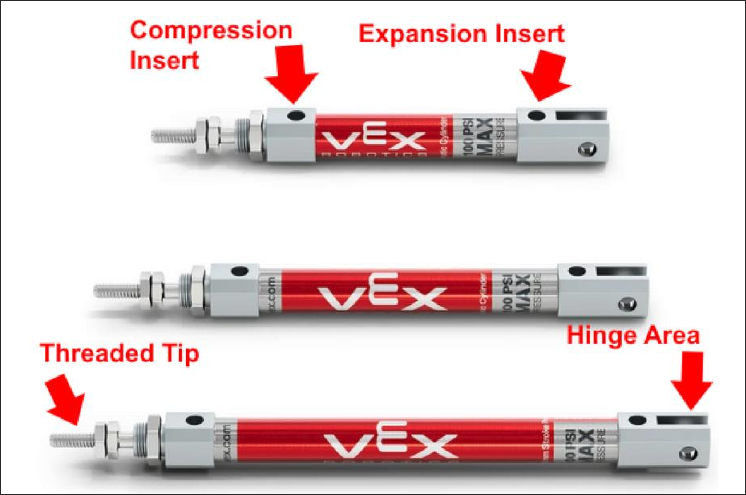
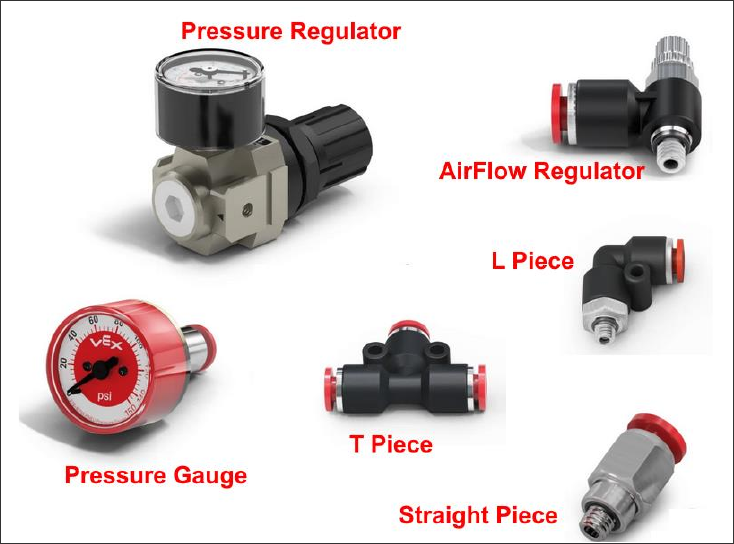
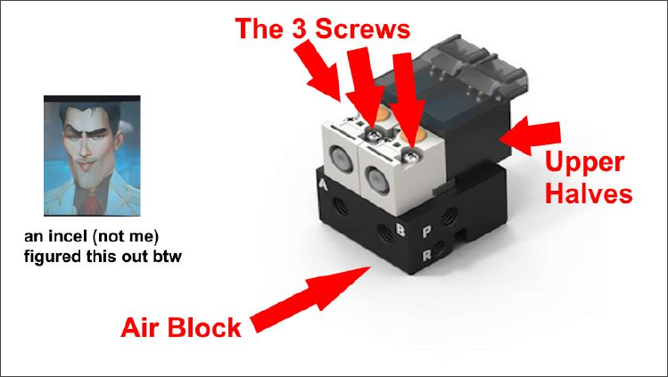

# VEX V5 Pneumatics

Pneumatics, as defined by Taeyul Im *(Disassociation Pending)*, is the usage of compressed air to transfer energy from a reserve into an actuator, such as a piston. What that means in VEX is that you have an air tank filled with (if you follow the rules) 6.8 times the air that it would normally have within its volume, which is released through tubes and gateways called solenoids, into pistons that either compress or extend.

## Parts

### Tanks
You can have up to 2 V5 Pneumatic Tanks on your robot. They can be either connected or separate. On the V5 tank there are two holes; any pneumatic insert with a thread on it will be able to enter the holes, but keep in mind that you need at least one gold fitting so that air may be pumped in (unless you are using the shutoff valve method; more on that below). Besides the gold fitting for air pressure, you must then attach either a 90 degree, straight, or speed fitting to the other end so that you can actually get air out of the tank through tubes, which will then lead into the rest of your system.

### Tubes
Tubes are just hollow plastic tubes that go into each of the pneumatic fittings to transporting air. You can use an unlimited amount of it, but excess tubing used for the sake of increasing air volume is prohibited. That being said, it is always beneficial to use more than less unless it gets in the way of something.

### Solenoids
This can be very difficult to understand. Imagine a solenoid as two doors on a wall. One door (we’ll call this one the Red Door) leads to one hallway and the other door (the Green Door) leads to a different hallway. A solenoid lets high-pressure air from the original room (your tank and tubes) enter one of the doors or neither, then transfers air down the tubes connected to them leading to either the bottom or front of a piston. A solenoid has two sides—each of the doors, if you will—with each side having an input for a wire, either red or green. Solenoids use a specific wire that has two ends to it—one green, one red—and one beginning from it that goes into the legacy (three-wire) port on the brains. Solenoids also have an exhaust for each side, so that when the door is no longer open, the air in its respective way can clear out and exit, allowing for the piston's reverse movement to occur. The solenoid also has two entrances on opposing sides. Both sides **need** an insert, but only one of them needs to be tubed to the brain. The other can just be plugged up to avoid all of your air shooting out.

### Pistons
You have 3 piston sizes: small, medium, and large. Pistons also have two holes for fittings. The piston extends when air is pumped into the hole near the base; it retracts when air is pumped into the hole near the front. Neither side of the piston should be plugged, but one can remain without a fitting on it if it does not need active air pressure. For example, a piston on a robot may have air actuation in its bottom half for extension but may rely on a rubber band for compression instead to save on air. Pistons also have an area at the bottom with two holes intended for usage with hinges or screws, so that the piston may move while it is extending for more radial motions. The tip of the piston has a thread on it, which can be spun into collars to create a hinge or can be tightened onto something with nuts to secure it to a mechanism. It is usually still connected to a hinge one way or another.

### Fittings
There are three main types of fittings: 90-degree or L fittings, straight fittings, and airflow valve fittings. 90-degree fittings are useful for angles or reducing the overall size of a piston; straight fittings are useful for straight applications and are also easier to tighten. Airflow valve fittings can reduce how quickly air enters or leaves a tube from it.

### Pressure Gauge
!!! warning
    In the 2026-2027 V5RC season Override, a Pressure Gauge is now **required** on any robot which uses pneumatics.

The Pressure Gauge reads off the pressure of your tank to make sure it's not above 100 psi.

### Pressure Regulator
This looks like a beefier pressure gauge and has two inserts on either side of it; it reduces the maximum pressure of whatever system lays beyond it. For example, my system could be operating at 100 psi, but I could have a pressure regulator before a solenoid that limits the pressure of the piston to 20 psi. The points of the regulator is to reduce unnecessary air loss and to keep your pneumatics operating a constant pressure. A non-regulating piston might reduce my 100 psi system to 70, then 54, and so on, which also reduces the power of the piston. If i set my pistons max pressure to 30, for example, I may only lose around 10 psi the first go and my piston would remain at a constant pressure the entire time.

### T-Fitting
The T-fitting, or splitter tube, allows you to diverge a tube into two paths. This can be used to activate two pistons from one solenoid or lead a tube from the tank into multiple solenoids or a pressure gauge. The possibilities are limitless. 

### Shutoff Valve
Finally, there is the shutoff valve, which shuts off airflow when closed. This is useless except when troubleshooting pneumatics or using a specific method of refilling the pneumatic tank.

## Repair
Unfortunately, Solenoids and V5 parts as a whole have a tendency to break. Because of how often pneumatics break and how many variations of breakage there are, it is actually quite easy to repair them. **NEVER THROW OUT A BROKEN PNEUMATIC!** We have a dusty box we throw them into in the cabinet.  

The solenoid has basically two halves beyond the original two halves we discuss earlier; those are the air half and the electronic half. These two halves can be disconnected by unscrewing the screws found at the top and removing them, leaving you with an Air Block and two wire pieces. It's important to note that the orientation when they are being reattached does not matter, because the original designer before VEX purchased the patent was actually pretty smart. The main ways a pneumatic can break are the following:  

* Exhaust becomes permanently open (Air block
becomes unusable without deeper repair)
* A port on the upper half becomes
damaged or snapped off, or part of it gets crushed

A solenoid can easily be repaired by removing the damaged portion and replacing it with a working part from either the spare parts from the other broken solenoids or a part removed directly from another broken solenoid. It's really quite simple: it's 3 screws max, and it's rather quite fun to do.

*By Brendan Duff*
