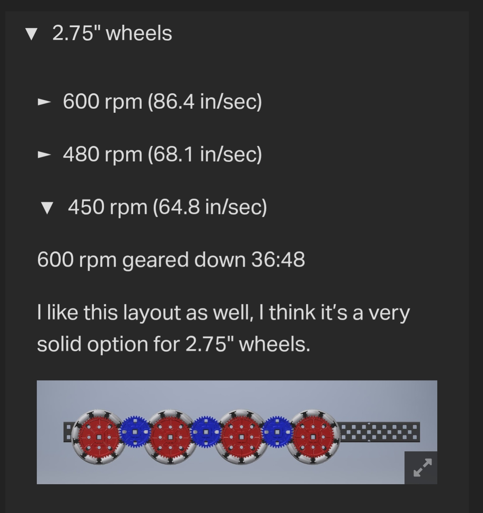
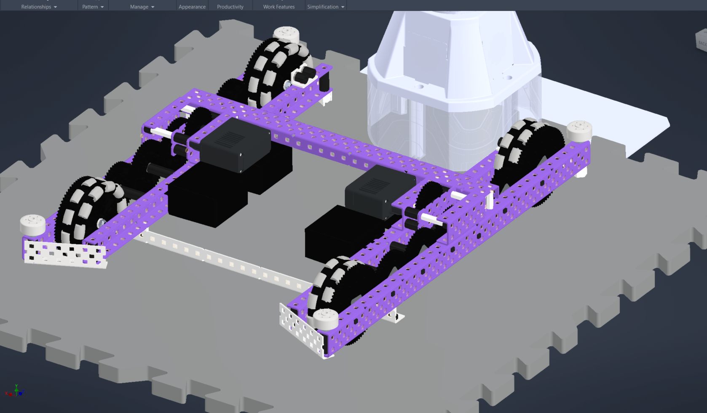
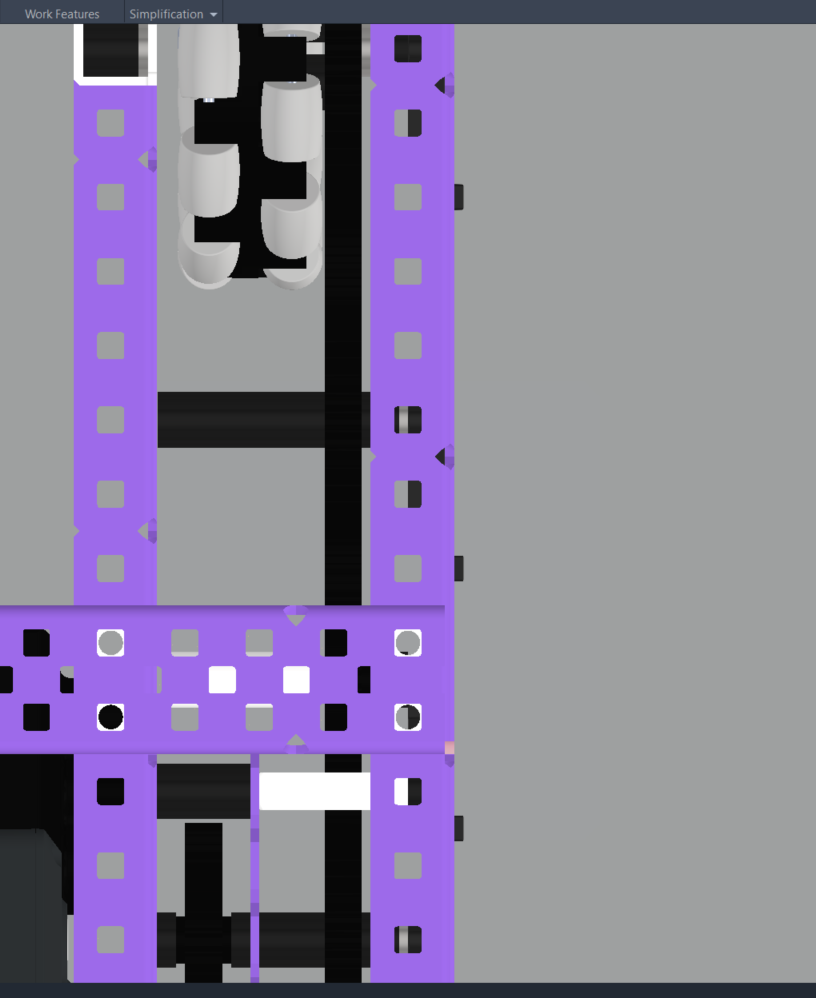
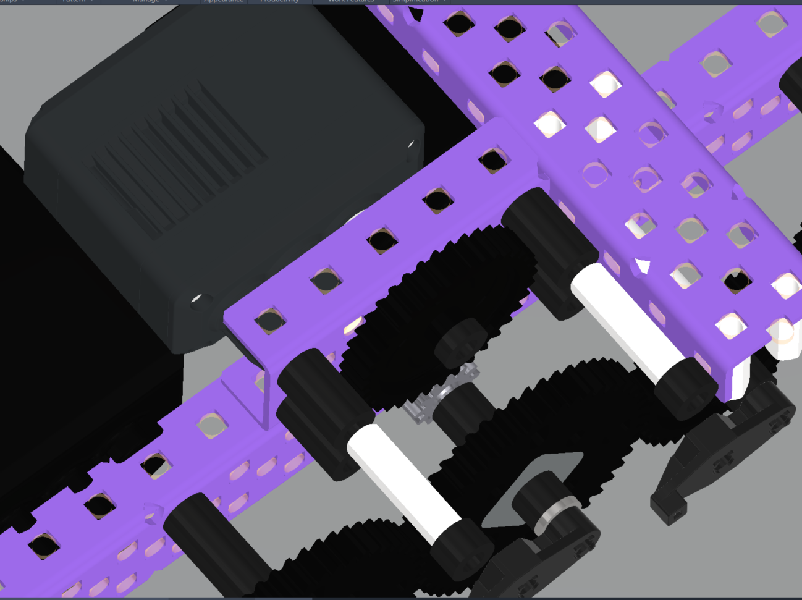

# Drivetrain Design 101

The drivetrain on your robot will be the MOST important part to do absolutely correctly. If you build it incorrectly you will have durability issues, overheating issues, and it will make auto less consistent and driving harder.

Fear-inducing first paragraph aside, building a decent drivetrain isn't impossible, even for absolutely new people who have never even touched the V5 system. With this write-up, my goal is to introduce you to the basics required to make a drive base that you can use for the rest of the year and give you the skills and knowledge required to understand what's needed.

## RPM and Wheel Size (Linear Speed)
Before we even start building/designing you will need to decide on a drivetrain design, the two main factors being drivetrain RPM and wheel size. The most important thing when deciding on the drive wheel size and RPM is going to be what we call **linear speed**, or the ratio of rpm and wheel size that determines the overall "speed" of a drive.

The following table provides some general advice for wheel size and RPM.

|                            | Peak speed | Pushing torque | Acceleration | Overheating risk |
| -------------------------- | ---------- | -------------- | ------------ | ---------------- |
| Bigger wheels / higher RPM | Higher     | Lower          | Lower        | Higher           |
| Smaller wheels / lower RPM | Lower      | Higher         | Higher       | Lower            |

### BIG GPT Formulas

$$
v = \frac{\text{RPM} \cdot \pi D}{60}
$$

RPM = wheel rotations per minute (after gear ratio)
D = wheel diameter

Dividing by 60 converts minutes to seconds. This gives a linear velocity in inches/sec or meters/sec depending on your units for $D$.

If you have gearing:

$$
\text{wheel RPM} = \text{motor RPM} \times \frac{\text{driving gear}}{\text{driven gear}}
$$

	
Then plug that into the speed formula, yielding:

$$
v = \frac{\text{motor RPM} \cdot (\frac{\text{driving}}{\text{driven}}) \cdot \pi D}{60}
$$

This gives theoretical maximum linear velocity of the robot assuming no slip.

### VEX Override Recommendations
With that out of the way this year (VEX Override) you will have 1 entire less motor on your drive. The usual standard in years past was a 6 motor drive (66w) with 2 extra motors for whatever you want. Since Override is evil, you will be limited to 55w drive or 5 motor drive. Due to this limitation, I would recommend a slightly slower drive then usual from past years. My favorite drive layout for a new person is **2.75” 450 rpm**.

If you want more information, I recommend reading [this](https://www.vexforum.com/t/catalogue-of-drive-gearings/109498), but I wouldn't copy the exact gearing of some of these.

I recommend this layout due to it having a low center of gravity, being easy to build and build around and having a good balance of speed and acceleration.

If you just want a recommendation for what drive to run you can skip the additional information section but if you want additional information I'll write it later.

## Drive Dimensions
Now that you've looked at drive speed and calculated linear speeds, drive dimensions are the next thing to take a look at. This will mainly be decided by what mechanisms you are making. This year, in Override, I recommend your drive length being 30+ holes long by 27 holes wide. This has been what I ran since High Stakes. I recommend a really long drive this year because of the expansion limit and longer drives tipping over less. I usually recommend as small as possible width wise as you can make but 27 leaves a lot of room for Odom pods and game elements, but 25-30 hole crossbars are not uncommon. 

/// caption
35X27 drive
///

### Drive Gap
You can choose between a 3 hole gap and a 4 hole gap (how wide the drive channels are apart). A 3 hole gap is always better if you make it right. It saves an inch on the drive and looks nicer, but 4 is fine and it's also easier to build.

/// caption
3 hole gap
///

## Drive Gearing
Drive gearing is going to be determined by the drive speed you choose and the length of drive you want. Using 450 rpm as an example, you will put all 48t gears on your wheels with your motors having 36t gears. The rest of the gears will be determined by the length of the drive you want. Gear types include 

* Wheel gears: these are the gears on your wheels; these all need to be the same size
* Drive gears: these are the gears on your motors these also need to be the same size unless your motors aren't running at the same speed. 
* Idler gears: these gears are just on the drive chain and aren't powered nor have a motor on them. These are useful for making your drive longer or shorter
    * 12t idler gears: almost any reasonably sized idler gears is fine except 12t. While you can run one it's not recommended because it's so small it will spin at a really high rpm significantly increasing friction.

### Gearing 5.5w Motors
You will most likely have a 4 motor drive with 2 5.5w motors in Override. Almost every drive uses 600 rpm blue cartridges, so this brings up a issue. 5.5 motors run at only 200 rpm, so in order to equalize this out you need to gear up the 200 rpm to 600. To do this you will have to make a "motor stack" and then most likely add a 36:12 gear ratio to the half motor, equalizing the RPMs.

/// caption
5.5w gearing
///

## Additional information
### Tile Sink
Wheels will tend to "sink" into the foam tiles due to how soft they are. To counteract this, you can add additional wheels, increasing your contact patch and sinking less. This keeps your drive running cooler and chassis slightly further above the ground. Now this doesn't necessarily mean more wheels = more better, because more wheels is both additional weight (meaning both overall weight and rotational mass which is generally considered bad) and also in MY personal experience it reduces your forward traction due to your wheels not digging into the ground as much

### All Omni Wheels vs. Traction Wheels
You will notice teams run all omnis and others run omnis with traction wheels. This should honestly be left up to coder/driver preference because both are viable options.

* Omnis: you will have more maneuverability options and I personally prefer this because it drives so much better but it can cause autos to be less consistent (though from my experience this isnt a huge issue) and also cause you to be vulnerable from pushing to the side (can be counteracted by skill again)
* Tractions: you will be less vulnerable to pushing sideways, you will have a consistent turning circle, and you will have more consistent autos.

* Turning center: turning center is the center point your drive turns around. On omnis this will be determined by your center of gravity (cog) and how many wheels you have. Due to it being affected by weight, grabbing elements can change your turning center. On traction wheels, it's determined by the location of the tractions. So I recommend putting your tractions in the middle.
