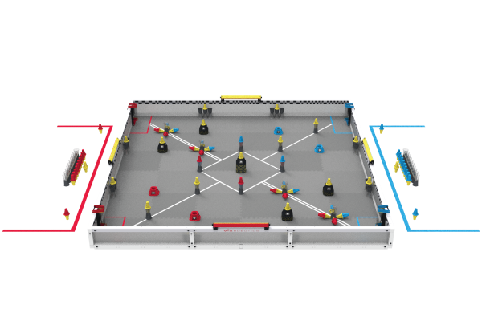

# Welcome
Hi! This is the Auburn Robotics Wiki, meant as an internal project to compile knowledge across teams and for the future of AHS robotics. For more, read the [about section](about.md)!

This is an internal knowledgebase; anyone at Auburn is [welcome to contribute](https://github.com/undonepotato/auburn-robotics-wiki)! If you're an outside reader that wants to help, open an issue on the GitHub.

/// caption
VEX Override 2026-2027
///

