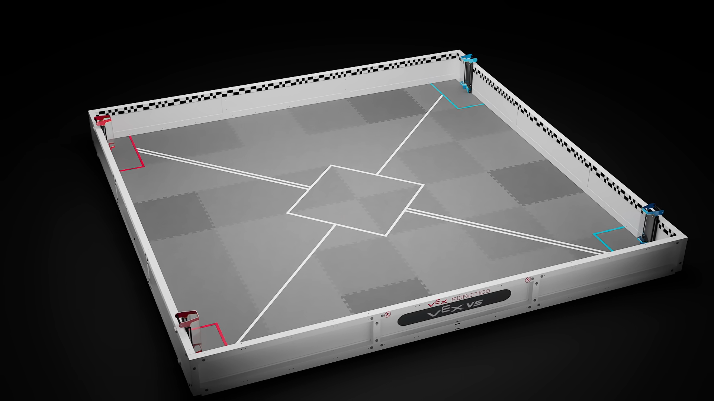
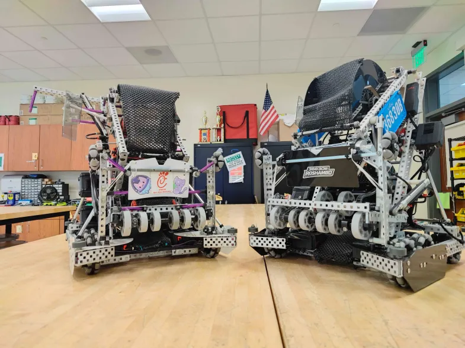
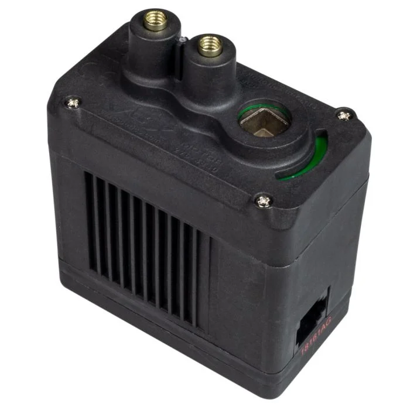
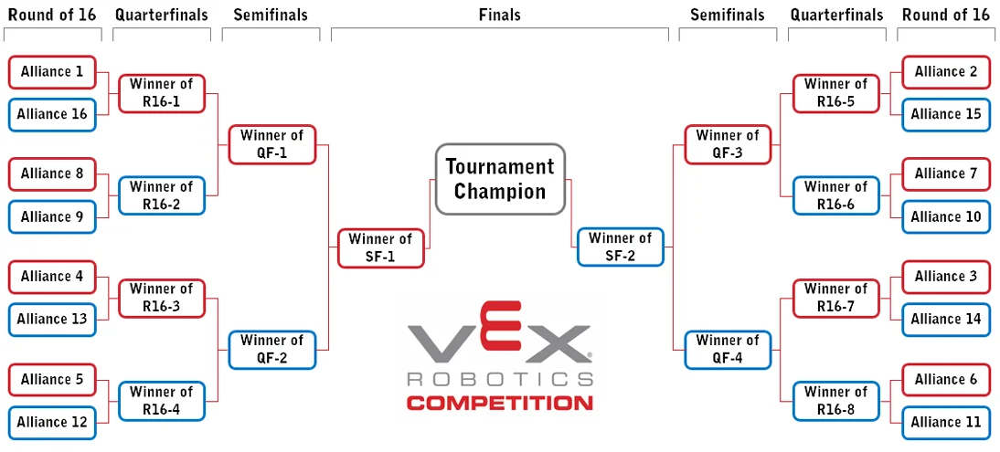

# A VEX V5 Crash Course
Specifically for former IQ competitors.

## Matches
Watch this [Q212 Design Division from 2026 Worlds](https://worlds.overclock.co/event/RE-V5RC-26-4025/division/9/stream?match=Qualifier+%23212&day=2026-04-23&t=24235) match for a good example of a representative V5 match, here including 36830B.

Matches in VEX V5 are 2v2, with a Red Team competing against a Blue Team. Unlike IQ, the most important metric for rankings is not how many points you score, but whether you win a match or not. A pairing of two Teams to compete in a match is called an Alliance.

### The Autonomous Period
At the start of every match, there is a 15-second Autonomous Period that is scored separately from the rest of the match to determine the winner of the Autonomous Bonus and Autonomous Win Point. In this period of the match, there can be no Driver control of the robot, and robots must move on their own to score points.

The most important rule in the Autonomous Period relates to the Autonomous Line, a double white line in the middle of the Field. **Crossing the Autonomous Line during the Autonomous Period is not allowed and forfeits the Autonomous Bonus to the other team.**

/// caption
The Autonomous Line in the 2026-2027 game, Override, runs diagonally from corner to corner. Note that the single white line running from the other two corners is safe to cross.
///

The match momentarily stops while the Referees score the Autonomous Bonus and determine who, if anyone, won AWP. It resumes for a 1:45 Driver Controlled Period after another countdown, which continues from the field state at the end of the Autonomous Period—e.g., it is not reset before the Driver Controlled Period starts.

#### Autonomous Bonus
**Whichever Alliance scores the most points in the Autonomous Period gets a fixed point bonus, called the Autonomous Bonus, that is added to their final score.**

* The value of this bonus is released in the Game Manual every year.

* A tie, including a 0-0 tie, results in this bonus being split among the two teams.

* There is no Autonomous Bonus if both teams commit Violations during the Autonomous Period.

* Per the Game Manual, the Autonomous Period is intended to be mostly offensive, not defensive. You should try to score points, not disrupt others from scoring points.

!!! warning
    Committing any Violations, Major or Minor, in the Autonomous Period forfeits the Autonomous Bonus to the other Alliance.

#### Autonomous Win Point
Completing a specific set of tasks together as an Alliance (the list varies by game and year) yields an Autonomous Win Point for the alliance. It is possible for both teams in a match to get the Autonomous Win Point, but only one can get the Autonomous Bonus. Win Points are useful (see [Win Points and Team Rankings](#win-points-and-team-rankings) below) in Qualification Matches and greatly affect your ranking for Alliance Selection, but are not a factor in Elimination Matches.

*Solo* AWP, referred to as "SAWP", is any robot program that can get the Autonomous Win Point by itself with minimal interaction from the Alliance team.

The proliferation of AWP among teams varies. In Alabama, it is relatively common for no teams to have SAWP until mid-season, and many teams never achieve SAWP. Successful implementation of SAWP is one of the most impactful contributions a programmer can make to a team.

The example match linked above includes an example of the Red Alliance choosing to use 78181A's SAWP.

!!! question "What's the difference between AWP and the Autonomous Bonus?"
    * In a given match, AWP is awarded to *any Alliance* that fulfills a specific set of criteria. AWP gives a [Win Point](#win-points-and-team-rankings), which is used in ranking teams. AWP can be awarded to neither Alliance, only one Alliance, or both Alliances. 
    * The Autonomous Bonus is a set of extra points given to the one Alliance that won the most points in the Autonomous Period, no matter *how* they got them. The Autonomous Bonus is usually awarded to one Alliance, but can be split in case of a tie or not awarded if both Alliances commit Violations in the Autonomous Period.

#### Autonomous Strategies
Many teams have some form of strategy selector to choose SAWP, a "teamwork auton" (working together with your Alliance Partner during the Autonomous Period to score points), or an autonomous routine to score the most points possible without worrying about AWP (common during Elimination Matches, when AWP is not a factor).

The vast majority of autonomous routines are "dumb"; they do not react to changing field conditions or other robots and rather just follow a set path to score Points or contribute to AWP. Reactive autonomous routines (those that dynamically adjust strategy based on other robots' performance), however, can be very beneficial for robustness and to show off code in the notebook and during interviews.

/// caption
[An example of](https://www.vexforum.com/t/v5-pre-autonomous-menu-chooser-vcs/57797) a pre-match autonomous selector program; these have become ubiquitous, since there are at least 4 possibilities for autonomous routines in every match.
///

### The Driver Control Period
The majority of time (1:45/2:00) in matches sees the driver controlling the team's robot. Autonomous routines rarely continue into this period, because the challenge becomes much more difficult—robots are moving entirely unpredictably, and you lose perfect information on what the field state is. That being said, it is possible to include macros to assist the Driver in this period as well.

#### Offensive and Defensive Strategies
An **offensive strategy** is any strategy or driving technique that focuses on scoring points by any mechanism the specific game provides. This is contrasted with **defensive strategies**, which focus on preventing opposing Alliances from scoring points or removing/invalidating the opposing Alliance's points. This does not only apply in the Driver Control Period, but is more common there as nearly all strategies in the Autonomous Period are offensive.

!!! note
    Being defensive doesn't mean destroying other robots or intentionally tipping them, both of which are prohibited (for better or for worse) by rule <GG14\>.

Some robots are inherently better for each style. Defensive robots are generally those that are heavy, powerful, and can push other robots around and stop them from scoring points. Offensive robots tend to be faster and lighter.

The Game Manual also mentions both types of driving; if a ruling is 50/50, the benefit of the doubt is given to the more offensive Alliance and against the more defensive Alliance (see rule <GG15\>.)

## Robots
Robots in V5RC are much larger, faster, and stronger than their IQ counterparts. It is common to be surprised at just how fast the bots are when first seeing them in the lab; since they're also made of metal, it is entirely possible for them to seriously injure you if you do something stupid. Safety!

### Structure
Unlike in IQ, robots are made of metal. Groundbreaking stuff. There are two types of metal that are legal for use: steel and aluminum. Steel is much heavier but more durable, and aluminum is much lighter and a bit easier to deform. Good building practice usually dictates saving weight and exclusively using aluminum. For more on this, check out the page on [good building techniques](building/building-habits.md)!

/// caption
36830A's and 36830B's robots from the 2025-2026 season, Push Back. These robots are constructed fully out of aluminum.
///

### Modifications
V5 allows modifications to almost all non-electrical parts and prohibits modifications to almost all electrical parts. This means that machinery and tools are regularly used to cut or bend metal pieces and shape plastic in desired ways.

### Custom Plastic
V5 allows a limited amount of custom plastic on robots. While this limit was much more generous in past years, teams are now limited to 12 pieces, each smaller than 4" x 8" x 0.070" (see rule <R24\>). It is illegal to chemically alter plastic from the allowed list in <R24\>.

3D-printed parts are disallowed for all purposes, including decorations. Sad.

### Pneumatics
The V5 pneumatics system is broadly similar to the IQ one, with the only everyday difference being that you have to use an air pump to pressurize your pneumatic system between matches (to the legal limit of 100 psi). These are easy to use, and you will learn how in the lab.

New in the 2026-2027 Override season is the requirement of a VEX-manufactured [Pressure Gauge](https://www.vexrobotics.com/spare-pneumatics.html) on every robot with pneumatics.

### Motors

/// caption
An [11-watt Smart Motor](https://www.vexrobotics.com/276-4840.html) with a green 200RPM cartridge installed.
///
There are two types of motors legal in V5RC: 5.5-watt motors and 11-watt motors. The motor limit for competitions is 88 watts, meaning up to 8 "full motors" and 16 "half motors". You can mix and match them as you wish; for example, 36830C in the 2025-2026 season used 6 11w motors and 4 5.5w motors ($6 \times 11 + 4 \times 5.5 = 88$).

Motors are controlled by sending a specific amount of voltage to them in code, but you generally don't work with raw voltage values ([PWM control](https://en.wikipedia.org/wiki/Pulse-width_modulation)) unless you're doing something advanced. VEX motor microcode includes tuned PID controllers to try to stay at a requested velocity despite loads or heat.

VEX motors also include encoders built-in so you can know the position of the motor for programming purposes.

#### 11-watt Motors
11w Smart Motors ("full motors") are the most common type of motor used. These are, in general, used for drivetrains, intakes, and scoring mechanisms that require more power than a 5.5w motor. They come with three swappable gear cartridges: a 36:1 red cartridge (100 RPM), a 18:1 green cartridge (200 RPM), and a 6:1 blue cartridge (600 RPM). This allows you to change the balance of torque and speed as necessary for a specific application.

!!! question "What is torque and speed?"
    *Torque* is the rotational equivalent of force in physics; basically, it's how hard you can push in a rotational sense. You would need a lot more torque to spin the Earth than you would to spin a fidget spinner. It trades off directly with speed; high torque usually means lower speed, and high speed usually means lower torque. The choice is very important in different mechanisms, and the decision should be made on a case-by-case basis.

#### 5.5-watt Motors
5.5w Smart Motors ("half motors") are less common, and are used for applications where you need independent power but not necessarily a lot of it. They're, in general, a bit more finicky than full motors. They are not compatible with gear cartridges and always have a maximum speed of 200 RPM.

## Competitions
Like VIQRC, we still go to competitions. In general, there are a few more V5 competitions than IQ ones in this area, though the exact numbers can vary. We usually go to around 4-6 regular competitions, one Signature Event, and States and Worlds.

### Format
The competition format is somewhat similar to IQ, but it is also very different. There are *Qualification Matches* and *Elimination Matches* at every event. At the start of a given day, you get a Match Schedule, like in IQ, where you can see your competition field, your Alliance Partner, and your opposing alliance.

> **Every competition is required to have at least six Qualification matches per team, per rule <T11\> in the Game Manual.**
Eight Qualification Matches are recommended, and you could have up to ten.

### Win Points and Team Rankings
See rule <T13\>.  

* Win Points are the main method of ranking teams. Winning a match yields two Win Points. Getting the Autonomous Win Point (a specific series of tasks you can complete in the Autonomous Period) yields one Win Point. Losing a match is zero Win Points.
* Autonomous Points are the secondary ranking (if there's a tie in number of Win Points), simply defined as the number of points you score in the Autonomous Period divided by the number of matches you play.
* Strength of Schedule Points are the third ranking. This is the number of points your opposing Alliance scores on average, theoretically meaning that teams with stronger opponents will be ranked higher than those with weaker ones.
    * Be cautious before trying to score points for the other Team to increase your SSP. This becomes illegal and a Major Violation (therefore a DQ) if you lose the Match.
* Highest Match score is fourth.
* Second-highest Match score is fifth.
* If all of the above are tied, the ranking is determined randomly.

### Alliance Selection
The following table gives the number of Elimination Alliances for the number of Teams in the competition. Note that an Alliance is two Teams.

| Number of Teams | Number of Elimination Alliances      |
| --------------- | ------------------------------------ |
| 32+             | 16                                   |
| 24-31           | 12                                   |
| 16-23           | 8                                    |
| <16             | (Number of Teams)/2, minus remainder |

Alliance Selection works like this:  

* Every Team, regardless of ranking, sends one person to the place the competition has designated for Alliance Selection.
* Every student representative stands in the order of their ranking; #1 is first, #2 is second, etc. (*When "#1 seed" is mentioned from now on, that means #1 ranking in Qualification Matches.*)
* The #1 seed alliance has first pick of who their Elimination Alliance will be (they are *Alliance Captain*). They are allowed to go down the line and pick any other team they want; that team can then accept or decline the invitation.
    * **If you haven't talked with and scouted the team beforehand, it's common courtesy to ask the team if they want to be picked before formally selecting them.**
    * If they accept the invitation, the Alliance is formed and the process repeats with the #2 (or next highest-ranked non-selected team) seed team picking their alliance.
    * If they decline the invitation, the #1 seed must ask another team to be their Alliance. The team that declined now *cannot be picked by any other team*; they must pick another team themselves when the process goes down to them (i.e., every team ranked higher than them has been picked).

  

    <iframe src="https://www.youtube.com/embed/3i-Z2ucZRqM" frameborder="0" allowfullscreen
      style="position:absolute;top:0;left:0;width:100%;height:100%;"></iframe>
  

### Elimination Matches
The 16-alliance bracket is shown below. Teams play in this order to determine the Tournament Champion.

* Tournaments that qualify to Worlds play their Final match as a best of 3, with the first Alliance to reach two wins being declared Tournament Champion.
* Elimination Matches have some rule changes related to Violations; for instance, Disqualifications apply to the entire alliance in Elimination Matches, not just the team that committed the Major Violation.
* Rematches are possible if ties occur. See <T19\>.

### Skills at Competitions
Similarly to IQ, each team has 3 opportunities for Driving Skills Matches and Autonomous Coding Skills Matches respectively. They are ranked first on the sum of these scores, then by their Autonomous score, then by nine other tiebreakers (see <T22\>).

### Badly Run Competitions
The quality of management at competitions varies wildly. In general, the ARC or SCORE-run ones will run without problems, but smaller competitions or those with new sponsors may struggle a bit. There has been a time where we waited multiple hours for the Drivers' Meeting to start because they were so behind schedule. (Ms. Sharman had to run skills at that event.)

### Signature Events
Signature Events are a special type of competition that qualifies directly to the World Championship without having to go through the Event Region Championships. They have a cap on the number of local teams that can participate, and teams with higher budgets will fly to far-flung places to have more chances to qualify to Worlds and win competitions.

* It is generally more difficult to get into a Signature Event, registration-wise, than a regular competition.
* Each Signature Event has about 3 Worlds slots, for the Tournament Champions and the winners of the Excellence Award.
* The only Signature Event that our teams go to is [SCORE Showdown](https://www.robotevents.com/robot-competitions/vex-robotics-competition/RE-V5RC-25-9912.html#general-info), which is generally held near the start of January.
* Registration fees for Signature Events are much larger than regular competitions.
* Signature Events are much longer than regular competitions. SCORE Showdown is held over three days, and you will generally miss school for it.
* Since it qualifies directly to Worlds, criteria for the Autonomous Win Point are more difficult.
* At AHS, you'll hear "Showdown", "Signature", and "Sigs" being used interchangeably, since we only participate in one Signature Event. They may also incorrectly be called "Leagues", but those are a different type of event that we generally don't participate in.

### States
The [Alabama State Championship](https://www.robotevents.com/robot-competitions/vex-robotics-competition/RE-V5RC-25-2027.html#general-info) is held in early February at the Coliseum, with a very similar format to SCORE Showdown.

* Capacity varies by year, but some teams get in through Skills every year.
* It generally takes two days: a Friday and a Saturday.
* As an Event Region Championship, this is an example of an event where the final match is best of 3.

### Worlds
The VEX Robotics World Championship happens every year in St. Louis, Missouri. The experience is broadly similar to IQ Worlds, with multiple divisions and the Dome being the only real format change. The AWP criteria are also the highest here.

## Expectations
V5 takes time. Being good in V5 takes much, much, *much* more time. Especially if you're a builder, but this applies to anyone. Dedication is the most important thing you can personally have—at least in my personal opinion, someone who's completely unskilled and completely willing to learn is miles better than a proficient person who's stagnating and doesn't put in the time or effort to continually improve themselves. Try, be responsible for what you do, believe that you can win, and work ***WITH*** your team to do it.
